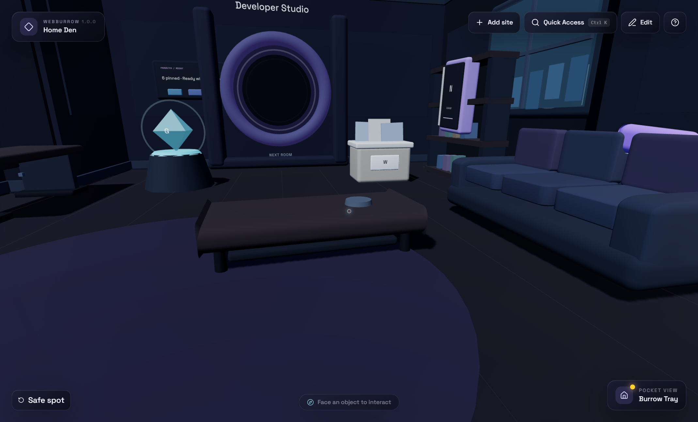
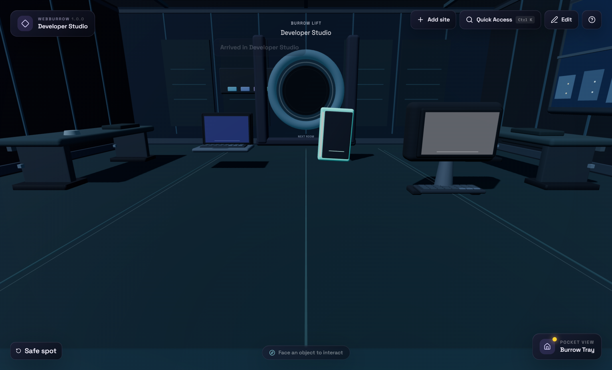
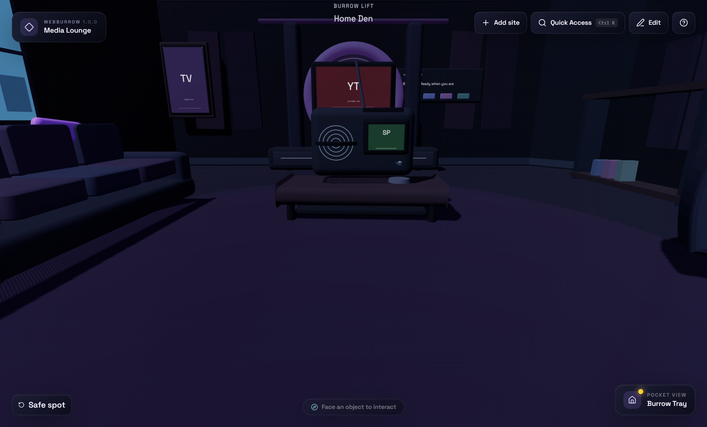
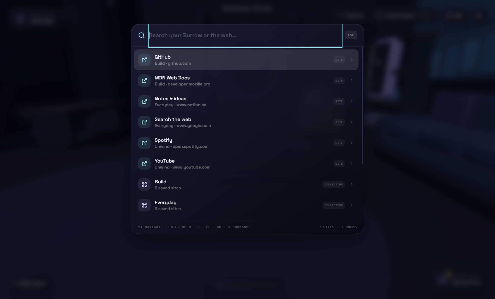
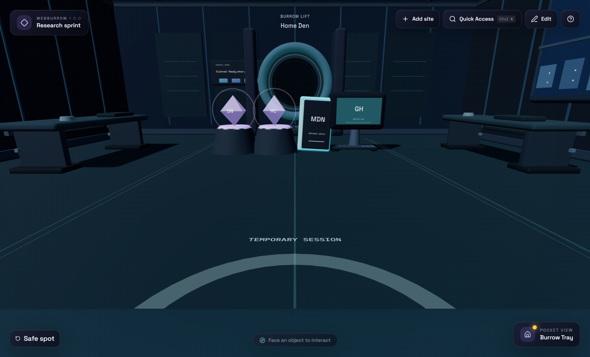

# WebBurrow 1.0.0

**Your internet is a place.** WebBurrow is a local-first spatial homepage where websites become objects in cozy procedural rooms, while Quick Access and the Burrow Tray keep everyday navigation fast.



WebBurrow 1.0.0 ships as a web application, an unsigned Windows desktop application, and an optional unpacked companion for Chrome, Edge, and Brave. It has no account, backend, telemetry, arbitrary website embedding, or required cloud storage.

## What is included

- Three distinct low-poly layouts: Home Den, Developer Studio, and Media Lounge, plus customized rooms built from those templates.
- Thirteen constructed site archetypes with beveled frames, readable silhouettes, restrained live-state cues, and contextual floor, desk, shelf, media-wall, and wall mounting.
- Keyboard-accessible site and room management, local bookmark/configuration import, collections, notes, favorites, recents, and safe placement editing.
- Quick Access search across local sites, rooms, collections, temporary sessions, integrations, events, feeds, notifications, actions, and explicit web-search results.
- Optional public GitHub, manually selected Open-Meteo weather, iCalendar, and text-only RSS/Atom integrations with offline cache fallback.
- Mini Burrow with shared layout geometry and up to four configurable cards.
- Optional session-only browser-tab workspaces delivered by a minimal-permission Chromium companion.
- Adaptive browser-session layouts: individual stations for small sets, labeled workstation banks for medium sets, and instanced dense racks for large transfers.
- Optional Windows notification-area tray, validated `webburrow://` routes, and a hardened native-messaging bridge.
- Muted-by-default generated UI/ambience audio and progressive, dismissible onboarding.

| Developer Studio | Media Lounge |
| --- | --- |
|  |  |

## Install on Windows

The installer is intentionally not committed or published. Build it locally:

```powershell
npm install
npm run desktop:dist
```

The output is `release/WebBurrow-Setup-1.0.0-x64.exe`. It installs per user, offers an install-directory choice, creates Desktop and Start Menu shortcuts using the supplied WebBurrow artwork, registers the `webburrow://` protocol, and registers the exact companion native-host origin for Chrome, Edge, and Brave. Because it is unsigned, Windows may show a SmartScreen warning.

For an unpacked desktop build, run `npm run desktop:pack`. See [Windows and source build instructions](docs/building.md).

## Run from source

Requires Node.js 22.13 or newer.

```bash
npm install
npm run dev
```

Use the local URL printed by the development server. Websites always open in the system browser or a new isolated tab; they are never iframed.

## Controls

| Input | Action |
| --- | --- |
| `W A S D` | Move |
| Mouse | Look around |
| `Shift` | Gentle sprint |
| `Space` | Jump |
| `E` | Use a nearby object or live surface |
| `Ctrl+K` or `/` | Quick Access |
| `T` | Burrow Tray |
| `Alt+1/2/3` | Travel to starter rooms |
| `Home` | Return to a safe spawn |
| `Esc` | Release mouse look / close dialog |

Every important workflow is also available through accessible HTML controls without first-person movement. Small windows default to a companion layout instead of attempting mouse-look gameplay.



Quick Access keeps local fuzzy results first. Use `> command`, `g query`, `yt query`, or `gh query`. Plain unmatched text only shows an explicit web-search result; it never launches automatically. DuckDuckGo is the default provider.

## Browser companion

```bash
npm run extension:build
```

Load `browser-extension/dist` as an unpacked extension in Chrome, Edge, or Brave. It can add the active page, send selected tabs/a window/a tab group into a temporary workspace, or preview chosen bookmarks for the existing local import flow. Required permissions are only `activeTab`, `storage`, and `nativeMessaging`; `tabs`, `tabGroups`, and `bookmarks` are requested when their matching feature is used.



Temporary workspaces never enter IndexedDB or configuration exports and disappear on the next launch unless explicitly promoted. See [browser companion setup and permissions](docs/browser-companion.md).

## Integrations and privacy

All integrations start disabled and make no request before explicit configuration.

- GitHub reads public repository data for up to five repositories, honors ETags, and refreshes hourly.
- Weather uses a city you select manually and never requests device location.
- Calendar supports local `.ics`, local events, and chosen HTTPS feeds with bounded recurrence expansion.
- RSS/Atom stores text-only headlines and safe article URLs; remote HTML is never rendered.

Web requests depend on the remote source’s CORS policy. Desktop requests use adapter-specific HTTPS operations with public-address pinning, redirect revalidation, MIME/size limits, and timeouts. Explicit favicon retrieval is same-origin, capped at 64 KiB, re-encoded to at most 64×64, locally cached, and excluded from exports.

See [privacy and security](PRIVACY_AND_SECURITY.md) for the complete boundary model.

## Architecture

- React 19, TypeScript, Vite/vinext, React Three Fiber, Drei, Rapier, Zustand, Dexie, Zod, and ICAL.js.
- A kinematic capsule controller owns frame-by-frame movement without publishing player telemetry through React.
- One shared room-layout registry drives world colliders, placement/mounting, migration, and the 2D Mini Burrow.
- Dexie schema 5 preserves earlier data while layout version 3 remaps legacy placement into the authored room footprints; portable exports remain ConfigEnvelope V3.
- Integration adapters return serializable search/tray/world view models; an isolated runtime handles cache-first refresh and stale fallback.
- Electron uses a sandboxed renderer, context isolation, a purpose-built preload, and discriminated privileged operations.

## Verify

```bash
npm run lint
npm run typecheck
npm test
npm run build
npm run desktop:build
npm run extension:build
```

The desktop smoke harness checks startup, preload availability, renderer console errors, selected release views, performance counters, and hidden-window suspension. The current suite contains 65 fixture-driven, integration, store, persistence, contract, and Testing Library checks. Full release steps are documented in [docs/building.md](docs/building.md).

## Known limitations

- Windows is the supported desktop target; the browser experience is desktop-first and touch gameplay is not implemented.
- The installer is unsigned, and the companion must be loaded manually rather than from a browser store.
- Web feed/calendar access works only when the source permits browser CORS; the desktop app provides the hardened transport.
- GitHub is public-only. There are no accounts, authenticated integrations, cloud sync, multiplayer, AI features, code signing, telemetry, or OS notifications.
- The 3D bundle is deliberately lazy-loaded but remains large because Three.js/Rapier are substantial dependencies.

See [the 1.0.0 release notes](docs/releases/1.0.0.md), [CHANGELOG.md](CHANGELOG.md), and [THIRD_PARTY_ASSETS.md](THIRD_PARTY_ASSETS.md).
